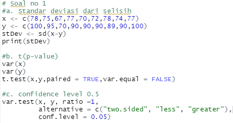
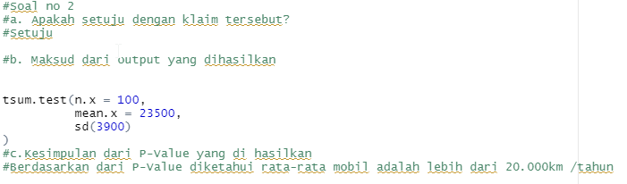
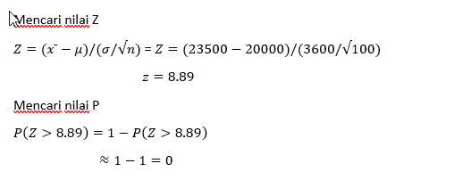
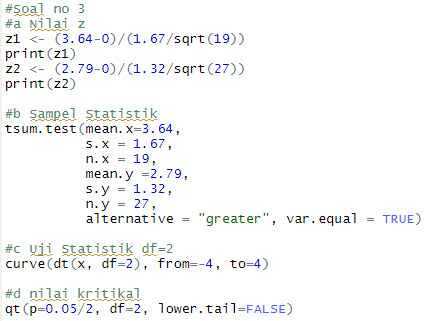
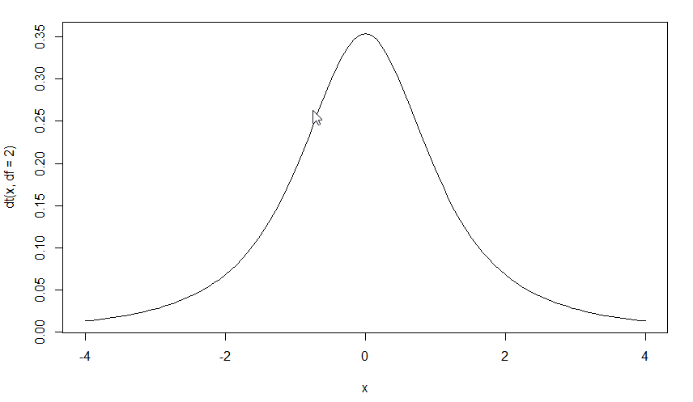
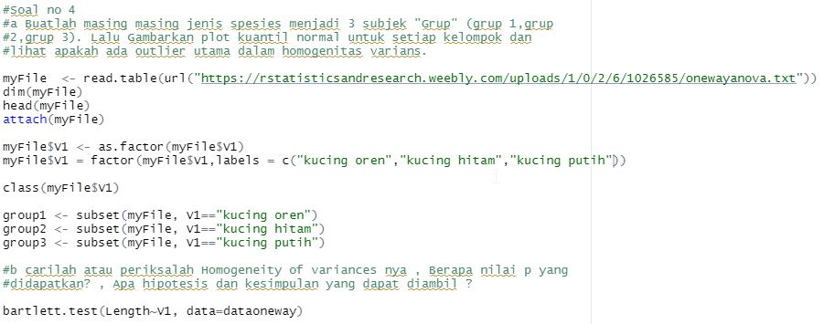

# P2_Probstat_A_5025201043
Praktikum 2 Probabilitas Statistik ITS 2021-2022 
 
## Soal no 1

### a. Carilah Standar Deviasi dari data selisih pasangan pengamatan tabel
Dilakukan input pada x dan y, kemudian kita gunakan   'sd' untuk mencari standar deviasi dengan mengurangi nilai x dengan y. 

### b. carilah nilai t (p-value)
Menggunakan 'var()' untuk mengecek varians dari variabel tersebut. Setelah diketahui berbeda, maka dilakukan pencarian dengan menggunakan t.test(), jika hasilnya TRUE maka merupakan pasangan.

### c. tentukanlah apakah terdapat pengaruh yang signifikan secara statistika dalam hal kadar saturasi oksigen , sebelum dan sesudah melakukan aktivitas 𝐴 jika diketahui tingkat signifikansi 𝛼 = 5% serta H0 : “tidak ada pengaruh yang signifikan secara statistika dalam hal kadar saturasi oksigen , sebelum dan sesudah melakukan aktivitas 𝐴”

Dapat kita lihat pada hasil perhitungan 'b' didapat nilai '6.003e-05', yang mana dapat kita simpulkan jika **H0** ditolak, karena nilai **p-value < H0**. Artinya ada pengaruh signifikan pada sebeluh dan sesudah melakukan aktifitas A
## Soal no 2

### a. Apakah Anda setuju dengan klaim tersebut?
Setuju

### b. Jelaskan maksud dari output yang dihasilkan
Pada soal sudah kita ketahui bahwa n = 100, Rata-Rata (X̄) = 23500, dan standar deviasi(σ) = 3900. Maka dari itu kita bisa menyimpulkan jika  **H0 = 20000** dan **H1 > 20000**

### c. Buatlah kesimpulan berdasarkan P-Value yang dihasilkan!

Berdasarkan dari perhitungan yang dilakukan, dapat kita ketahui bahwa rata-rata mobil menempuh jarak lebih dari 20.000 km/tahun.

## Soal no 3

### a. H0 dan H1
Perhitungan **H0** dan **H1** dapat dilakukan sebagai mana pada gambar atau rumusnya **Z=(x ̄-μ)/(σ/√n) **

### b. Hitung Sampel Statistik

Dapat dilihat bahwa pada bagian **3.b** pada gambar telah dilakukan perhitungan

### c. Lakukan Uji Statistik (df =2)

Dimuat dengan menggunakan fungsi 'curve'
## Soal no 4

### a. Buatlah masing masing jenis spesies menjadi 3 subjek "Grup" (grup 1,grup 2,grup 3). Lalu Gambarkan plot kuantil normal untuk setiap kelompok dan lihat apakah ada outlier utama dalam homogenitas varians.

dengan dengan mengimport data dari link yang telah disediakan, dengan memasukan nya pada **myFile**. Kemudian dibuatkan menjadi group dengan label yang telah ditentukan. Kita dapat mengecek nilai valuenya dengan fungsi Class(myFile$Group). Setelah itu kita bagi grupnya sesuai label dengan fungsi **subset**

### b. carilah atau periksalah Homogeneity of variances nya , Berapa nilai p yang didapatkan? , Apa hipotesis dan kesimpulan yang dapat diambil ?
Digunakan fungsi 'bartlet.test' untuk mendapatkan nilai p-valuenya. Dimana nilai nya = = 0.8054. Dapat disimpulkan Bartlett's K-squared memiliki nilai sebesar 0.43292 dengan df bernilai 2.
## Soal no 5
